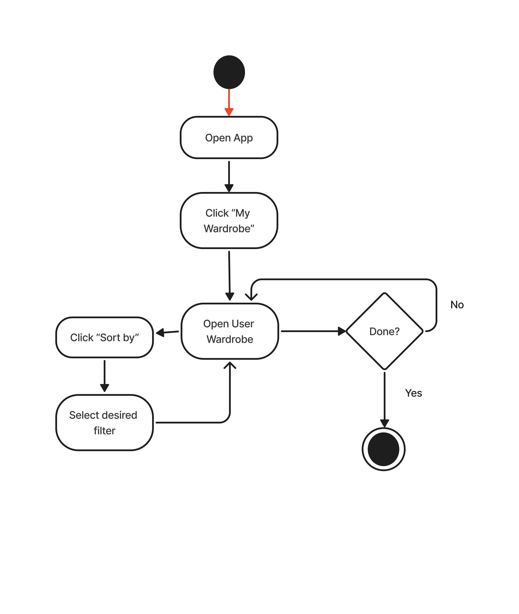
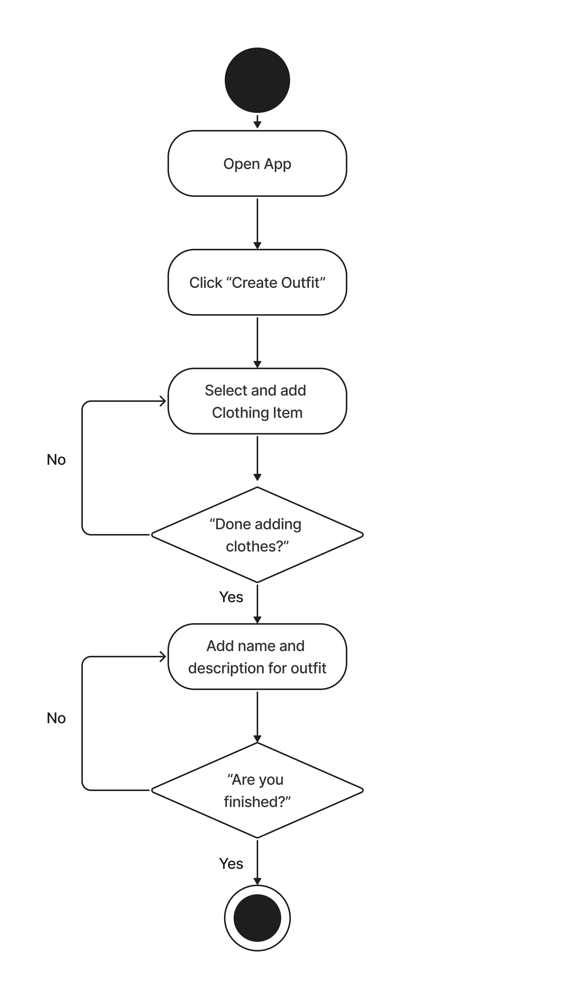

# Specification Phase Exercise

A little exercise to get started with the specification phase of the software development lifecycle. See the [instructions](instructions.md) for more detail.

## Team members

Sean Lee: https://github.com/jseanlee

## Stakeholders

**Name: Melissa Shin**

About my Stakeholder: My stakeholder works for a fashion retail brand. With a career in fashion and a deep-rooted interest in clothing, she is deeply invested in the clothing space, and can consequently have too many clothes in one sitting.

Goals, needs, & Desires:
- I want to be able to track what I wear daily
- I want to easily categorize and visualize my clothes
- Reduce closet clutter: remove clothes that I don't wear/that I have in excess
- Coordinate and plan outfits seamlessly

Problems & Frustrations:
- Closet clutter: too much clothes in closet
- Frustrated with repeatedly wearing the same outfits despite having more clothes
- Hard to keep track of seasonal clothing that is out of closet/in storage
- I don't like when I buy clothing, just to hardly ever wear it because I forget to choose

## Product Vision Statement

___Our mobile application enables users to effortlessly organize their wardrobe electronically, categorize items by various characteristics, and track daily outfits, helping them stay more connected with their personal style.___

## User Requirements

1. As someone looking to do some spring cleaning, I want to see what clothes I hardly wear so that I can clean out my closet!
2. As a budding fashionista, I want to categorize what clothes I own so that I can mix-and-match and figure out new outfits.
3. As a user, I want to see what kind of clothing I am lacking in (pants, shirts, dress shoes, etc.) so that I can balance out my wardrobe more.
4. As a sustainability-conscious buyer, I want to be able to track how often I wear certain items of clothing so that I can make better and more informed purchases and reduce waste.
5. As a busy career man, I want to plan my outfits well in advance so that I can save time in the morning and be prepared to look good. 
6. As an avid online shopper, I want to add my digital purchases to a digital wardrobe so I can see how they would look next to my existing clothes. 
7. As a resident in an area with multiple seasons, I want to track my clothes by what season I wear them in so I know what to keep in my closet and what to leave in storage.
8. As someone with a small closet, I want to be able to digitally organize my clothing so that I can maximize the use out of my closet space.
9. As a parent with many kids, I want to be able to track which clothing is whose, so that I don't mix up clothing between my different children. 
10. As a student, I want to be able to create and plan different outfits for school, career, and social events, so that I can be best prepared for a variety of occasions.

## Activity Diagrams

As a user, I want to see what kind of clothing I am lacking in (pants, shirts, dress shoes, etc.) so that I can balance out my wardrobe more.

As a student, I want to be able to create and plan different outfits for school, career, and social events, so that I can be best prepared for a variety of occasions.

## Clickable Prototype

